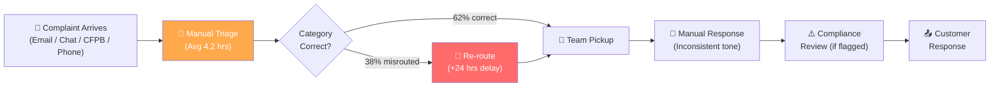
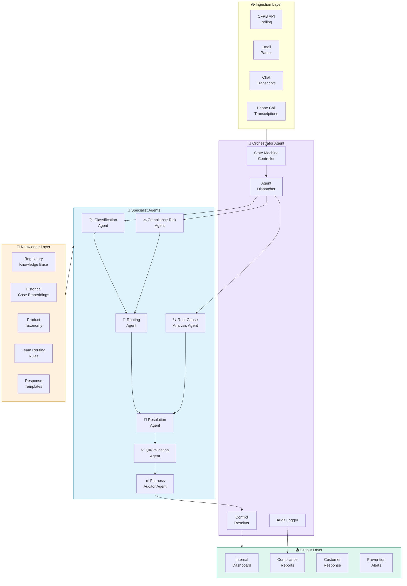
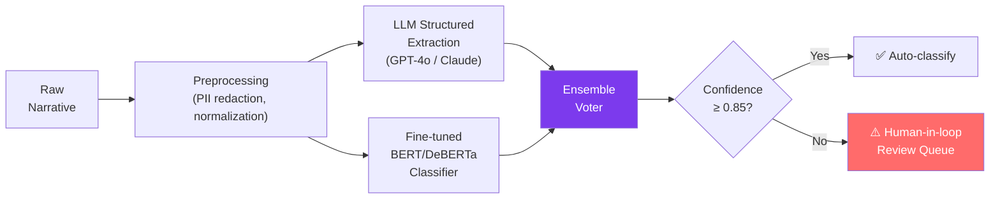
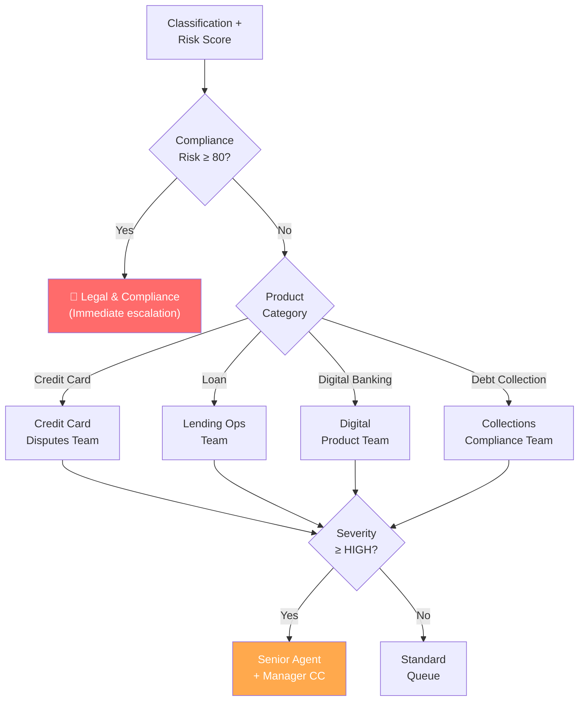
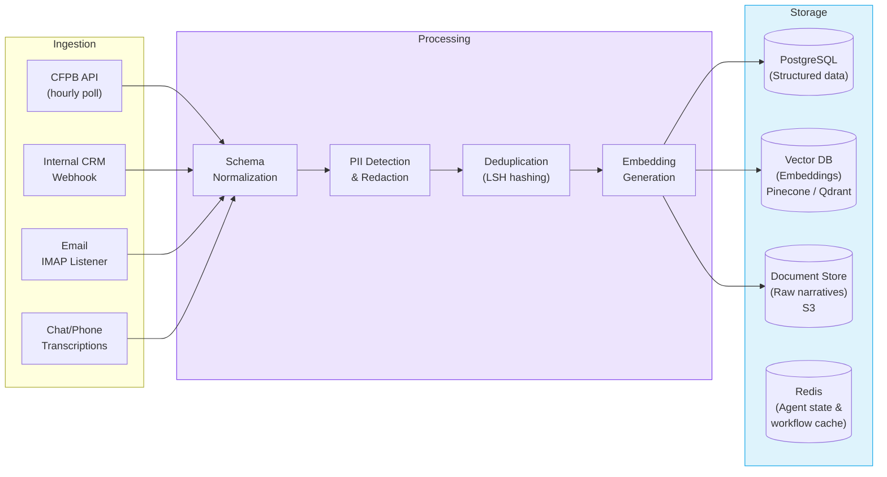
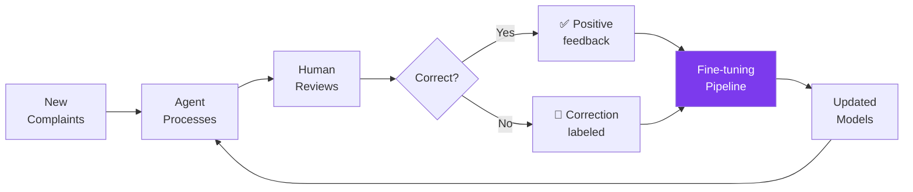
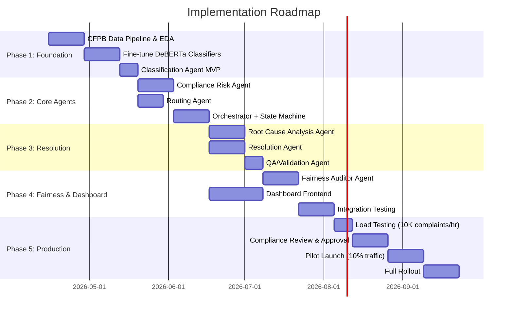

# 🏦 Agentic AI Complaint Categorization System — Deep Brainstorm

## 1. Problem Anatomy

### What's Broken Today



| Pain Point | Business Impact |
|---|---|
| **Inconsistent categorization** | 38% of complaints mis-routed → avg +24hr resolution delay |
| **Manual routing** | 4.2 hours average triage time per complaint |
| **No severity scoring** | High-risk UDAAP violations treated same as billing inquiries |
| **Reactive, not preventive** | Root causes identified only after regulatory scrutiny |
| **Compliance exposure** | Inconsistent responses risk CFPB enforcement actions |
| **No fairness auditing** | Disparate treatment risks across demographics invisible |

### The CFPB Data Source

The [CFPB Consumer Complaint Database](https://www.consumerfinance.gov/data-research/consumer-complaints/) provides ~4M+ complaints with these key fields:

| Field | Description | Our Use |
|---|---|---|
| `date_received` | When CFPB received the complaint | Temporal trend analysis |
| `product` | Financial product (Credit Card, Mortgage, etc.) | **Primary classification target** |
| `sub_product` | More specific product type | **Secondary classification** |
| `issue` | The consumer's complaint issue | **Issue classification** |
| `sub_issue` | More specific issue detail | Granular routing |
| `consumer_complaint_narrative` | Free text complaint — **the gold** | NLP input for all agents |
| `company_public_response` | Company's public response | Training data for response generation |
| `company` | Company name | Peer benchmarking |
| `state` | Consumer's state | Geographic pattern detection |
| `tags` | Special populations (Older American, Servicemember) | Fairness & priority signals |
| `consumer_consent_provided` | Whether narrative was published | Data availability filter |
| `company_response_to_consumer` | Resolution type | Outcome prediction training |
| `timely_response` | Was response timely? | SLA modeling |

---

## 2. Proposed Architecture: Multi-Agent Orchestration

### The Big Picture



---

## 3. Agent Deep Dives

### Agent 1: 🏷️ Classification Agent

**Mission**: Extract structured labels from unstructured complaint narratives.

**Inputs**: Raw complaint text + metadata (channel, date, customer tier)

**Outputs**:
```json
{
  "product": "Credit Card",
  "sub_product": "General-purpose credit card or charge card",
  "issue": "Problem with a purchase shown on your statement",
  "sub_issue": "Credit card company isn't resolving a dispute",
  "sentiment_score": -0.82,
  "urgency": "HIGH",
  "confidence": 0.94,
  "reasoning": "Consumer describes unauthorized charges of $3,200 across 4 transactions. Dispute was filed 45 days ago with no resolution. Language indicates extreme frustration and threat to escalate to attorney general."
}
```

**Strategy — Hybrid Classification Pipeline**:



1. **Fast path**: Fine-tuned DeBERTa classifier (trained on CFPB historical data) provides millisecond-level product/issue classification
2. **Deep path**: LLM provides nuanced extraction — sub-issues, root cause hints, sentiment, and *reasoning* chain
3. **Ensemble**: Weighted vote between both. If they disagree or confidence < 0.85 → human review queue

> [!TIP]
> The CFPB dataset has ~4M labeled examples — this is a **dream dataset** for fine-tuning. Product/issue labels are pre-annotated, and narratives with consent provide rich training text.

---

### Agent 2: ⚖️ Compliance Risk Agent

**Mission**: Score regulatory risk and flag potential violations.

**Risk Taxonomy**:

| Risk Category | Description | Severity Weight |
|---|---|---|
| **UDAAP** | Unfair, Deceptive, Abusive Acts/Practices | 🔴 Critical (10) |
| **ECOA/Fair Lending** | Discrimination signals in complaint | 🔴 Critical (10) |
| **TILA/Reg Z** | Truth in Lending Act violations (APR, disclosures) | 🟠 High (8) |
| **FCRA** | Fair Credit Reporting issues | 🟠 High (7) |
| **EFTA/Reg E** | Electronic fund transfer errors | 🟡 Medium (5) |
| **SCRA** | Servicemember Civil Relief Act | 🔴 Critical (9) |
| **Elder Abuse** | Financial exploitation of older adults | 🔴 Critical (10) |
| **Repeat Offender** | Same customer, 3+ complaints in 90 days | 🟠 High (7) |

**How it works**:
- **Keyword/pattern detection**: Regulatory lexicon matching (e.g., "didn't disclose", "misled", "hidden fee", "because of my race")
- **LLM analysis**: Prompt-engineered to identify regulatory implications with chain-of-thought reasoning
- **Historical correlation**: Embeddings similarity search against complaints that resulted in enforcement actions
- **Output**: Risk score (0-100), applicable regulations, and *explainable justification*

> [!IMPORTANT]
> Every risk determination must have a human-readable explanation chain. Regulators will not accept "the model said so." Each flag must cite the specific narrative excerpt + the regulation it potentially violates.

---

### Agent 3: 🔍 Root Cause Analysis Agent

**Mission**: Identify systemic patterns, not just individual complaints.

**Technique stack**:
1. **Topic Modeling** (BERTopic): Cluster complaint narratives to discover emerging issue themes
2. **Temporal Anomaly Detection**: Flag sudden spikes in specific complaint categories (e.g., "mobile app login failures" jumping 300% in a week)
3. **Causal Chain Extraction** (LLM): From narratives, extract structured causal chains:

```
TRIGGER: App update v4.2.1 → 
SYMPTOM: Users unable to access account → 
BEHAVIOR: Called customer service, transferred 3 times → 
OUTCOME: Filed CFPB complaint citing "inability to access funds"
```

4. **Cross-complaint correlation**: Link individual complaints to systemic issues using embedding similarity (e.g., 47 complaints about "mystery $9.99 charge" = billing system bug, not isolated fraud)

**Output**: Root cause report with:
- Issue cluster ID & description
- Affected product/service area
- Estimated customer count impacted
- Trend direction (growing/stable/declining)
- Recommended systemic fix

---

### Agent 4: 🎯 Routing Agent

**Mission**: Assign complaints to the right internal team with optimal workload balancing.

**Routing Logic**:



**Smart features**:
- **Workload aware**: Query team capacity in real-time; route to available agents
- **Skill matching**: Match complaint complexity to agent experience level
- **SLA-driven**: Factor in regulatory response deadlines (CFPB = 15 days, state AG = varies)
- **Round-robin with affinity**: Same customer → same agent when possible

---

### Agent 5: 📝 Resolution Agent

**Mission**: Generate complete resolution plans + customer-facing responses.

**Outputs three artifacts**:

#### A. Internal Resolution Plan
```markdown
## Resolution Plan — Case #CC-2026-04892

**Priority**: HIGH | **SLA Deadline**: April 29, 2026
**Assigned To**: Credit Card Disputes Team → Agent: Sarah M.

### Immediate Actions (Day 1)
1. Place provisional credit of $3,200 on customer account (Reg Z §226.13 requires within 1 billing cycle)
2. Initiate merchant chargeback for 4 disputed transactions
3. Flag account for fraud monitoring

### Investigation Steps (Days 2-10)
1. Pull transaction logs for dates 03/01-03/15
2. Verify customer's dispute timeline against internal records
3. Contact merchant processor for transaction authentication records

### Resolution (Day 10-14)
1. Based on investigation: finalize credit or reverse provisional
2. Update customer with determination letter
3. File SAR if fraud confirmed
```

#### B. Customer Response (Regulatory-Compliant)
- Acknowledges specific complaint within 24 hours
- References applicable regulation without legal jargon
- Provides concrete next steps and timeline
- Includes required disclosures (Reg Z dispute rights, etc.)

#### C. Preventive Recommendations
- Feed root cause findings back to product teams
- Suggest process/system changes to prevent recurrence

---

### Agent 6: ✅ QA/Validation Agent

**Mission**: Quality-check every output before it leaves the system.

**Validation checklist**:
- [ ] Classification matches narrative content (semantic consistency check)
- [ ] Risk score aligns with identified regulatory concerns
- [ ] Response contains required regulatory disclosures
- [ ] No PII leakage in any output
- [ ] Response tone is empathetic, professional, non-adversarial
- [ ] Resolution timeline meets SLA requirements
- [ ] No hallucinated facts (cross-reference against complaint)

**Technique**: Second LLM call with "adversarial reviewer" prompt — tries to find errors, omissions, and compliance gaps in the output.

---

### Agent 7: 📊 Fairness Auditor Agent

**Mission**: Detect and prevent disparate treatment/impact across demographics.

**Monitors**:
- Resolution time by ZIP code / state (proxy for demographics)
- Resolution quality ($ remediation, tone score) across customer segments
- Routing patterns — are certain demographics disproportionately routed to junior agents?
- Classification consistency — does same complaint text get different labels based on metadata?

**Technique**: 
- Statistical parity tests on outcomes
- Counterfactual fairness analysis (perturb demographic proxies, check if classification changes)
- Regular bias audits with published results

> [!CAUTION]
> Fairness auditing is not optional — it's a regulatory requirement. ECOA and fair lending laws apply to complaint handling, not just lending decisions. Disparate treatment in complaint resolution is an enforcement risk.

---

## 4. Data Pipeline Architecture



### Key Design Decisions

| Decision | Choice | Rationale |
|---|---|---|
| **PII handling** | Redact before any LLM call; separate PII vault | Regulatory requirement; prevents model memorization |
| **Embedding model** | `text-embedding-3-large` or fine-tuned `e5-large-v2` | Need domain specificity for financial complaints |
| **Vector DB** | Qdrant (self-hosted) or Pinecone (managed) | Sub-50ms retrieval for RAG and similarity search |
| **Workflow engine** | LangGraph or Temporal.io | Durable execution; resume on failure; audit trail |
| **LLM provider** | Primary: GPT-4o / Claude 3.5 Sonnet; Fallback: Gemini | Reliability + cost management via routing |

---

## 5. ML/NLP Strategy

### Phase 1: Foundation — Fine-Tuned Classifiers (Weeks 1-4)

**Training data**: CFPB database (filter `consumer_consent_provided = true` for narratives)

| Model | Task | Expected Accuracy |
|---|---|---|
| DeBERTa-v3-large (fine-tuned) | Product classification (18 categories) | ~94% F1 |
| DeBERTa-v3-large (fine-tuned) | Issue classification (80+ categories) | ~87% F1 |
| Custom RoBERTa | Severity scoring (Low/Med/High/Critical) | ~91% F1 |
| Sentence-BERT | Complaint embedding for similarity search | N/A (quality metric) |

### Phase 2: LLM Augmentation (Weeks 3-6)

- Structured extraction via function calling / tool use
- Chain-of-thought reasoning for compliance risk
- Response generation with regulatory guardrails
- Root cause narrative synthesis

### Phase 3: Continuous Learning (Ongoing)



---

## 6. Performance Metrics & KPIs

### System Performance

| Metric | Target | Measurement |
|---|---|---|
| **Classification Accuracy (Product)** | ≥ 93% F1 | Weekly eval against human labels |
| **Classification Accuracy (Issue)** | ≥ 85% F1 | Weekly eval against human labels |
| **Risk Scoring Precision** | ≥ 95% for Critical | False negative rate on high-risk |
| **Auto-resolution Rate** | ≥ 60% of complaints | % handled without human intervention |
| **Processing Latency** | < 30 seconds end-to-end | P95 latency from ingestion to plan |
| **Throughput** | 10,000 complaints/hour | Peak load capacity |

### Business Impact

| Metric | Baseline (Manual) | Target (AI System) | Improvement |
|---|---|---|---|
| **Avg. Resolution Time** | 8.3 days | 2.1 days | **75% faster** |
| **Misrouting Rate** | 38% | < 5% | **87% reduction** |
| **CFPB Timely Response Rate** | 82% | 99% | **+17pp** |
| **Compliance Risk Catches** | Post-hoc only | Real-time | **Shift left** |
| **Customer Re-complaint Rate** | 24% | < 8% | **67% reduction** |
| **Agent Productivity** | 12 complaints/day | 45 complaints/day | **3.75x** |

### Fairness Metrics

| Metric | Target |
|---|---|
| **Demographic Parity Ratio** (resolution time) | 0.80 ≤ ratio ≤ 1.20 |
| **Equalized Odds** (severity classification) | Δ FPR, Δ TPR < 0.05 |
| **Counterfactual Fairness Score** | > 0.95 consistency |
| **Disparate Impact Ratio** (resolution quality) | ≥ 0.80 (4/5ths rule) |

---

## 7. Regulatory Compliance Architecture

### Explainability for Regulators

Every decision the system makes must produce an **audit trail**:

```json
{
  "complaint_id": "CC-2026-04892",
  "timestamp": "2026-04-15T01:30:00Z",
  "decision_chain": [
    {
      "agent": "ClassificationAgent",
      "decision": "product=Credit Card, issue=Purchase dispute",
      "confidence": 0.94,
      "reasoning": "Narrative mentions 'credit card statement', 'unauthorized charges', 'dispute filed'. DeBERTa classifier confidence: 0.96. LLM extraction agreement: yes.",
      "evidence_spans": ["charged $3,200 to my credit card", "filed a dispute on March 1"]
    },
    {
      "agent": "ComplianceRiskAgent", 
      "decision": "risk_score=72, flags=[TILA_REG_Z, REPEAT_COMPLAINANT]",
      "reasoning": "Customer alleges dispute was not investigated within Reg Z timeline (§226.13(d) requires resolution within 2 billing cycles). This is the customer's 2nd complaint in 60 days.",
      "evidence_spans": ["filed dispute 45 days ago", "no one has contacted me"]
    },
    {
      "agent": "RoutingAgent",
      "decision": "team=Credit Card Disputes, priority=HIGH, agent=Sarah M.",
      "reasoning": "Risk score 72 exceeds threshold for senior agent assignment. Sarah M. has capacity and specialization in Reg Z disputes."
    }
  ]
}
```

### Regulatory Mapping

| Regulation | System Capability |
|---|---|
| **CFPB Complaint Handling** | Automated 15-day response tracking; timely acknowledgment generation |
| **Reg Z (TILA)** | Dispute timeline monitoring; provisional credit triggers |
| **Reg E (EFTA)** | Electronic transaction error resolution tracking |
| **FCRA** | Credit reporting dispute workflow integration |
| **UDAAP** | Pattern detection for unfair/deceptive practices across complaint clusters |
| **ECOA** | Fairness auditor prevents disparate treatment in resolution quality |
| **State Laws** | Jurisdiction-aware response templates (e.g., CA, NY have stricter requirements) |

---

## 8. Technology Recommendations

### Core Stack

| Layer | Technology | Why |
|---|---|---|
| **Orchestration** | **LangGraph** (Python) | Graph-based state machine; durable execution; human-in-loop checkpoints; native LangSmith observability |
| **LLM Backbone** | **GPT-4o** (primary) + **Claude 3.5 Sonnet** (fallback) | Best structured extraction + reasoning; cost-effective routing |
| **Fine-tuned Models** | **DeBERTa-v3-large** on HuggingFace / vLLM | Fast inference for classification; trainable on CFPB data |
| **Embeddings** | **text-embedding-3-large** | Best quality/cost for financial domain |
| **Vector Store** | **Qdrant** or **Pinecone** | Similarity search for case matching & RAG |
| **Backend** | **FastAPI** (Python) | Async, high-perf, excellent LangChain integration |
| **Database** | **PostgreSQL** + **TimescaleDB** | Structured storage + time-series analytics |
| **Queue** | **Redis Streams** or **Kafka** | High-throughput complaint ingestion |
| **Frontend** | **Next.js** + **shadcn/ui** | Dashboard for ops team & compliance |
| **Observability** | **LangSmith** + **Datadog** | Agent tracing, cost tracking, latency monitoring |
| **Workflow** | **Temporal.io** (optional) | Long-running workflow durability beyond LangGraph |

---

## 9. Interactive Dashboard Concept

### Ops Dashboard Views

**1. Real-Time Triage View**
- Live feed of incoming complaints with AI classifications
- Color-coded risk scores (red/orange/yellow/green)
- One-click override for human reviewers
- Auto-expanding explanation panels for each decision

**2. Analytics & Trends**
- Complaint volume heatmaps by product, issue, geography
- Root cause cluster visualization (force-directed graph)
- SLA compliance gauges (timely response rate)
- Comparison benchmarks vs. industry peers (from CFPB public data)

**3. Compliance Command Center**
- Regulatory risk radar — aggregate risk by regulation type
- Escalation queue with countdown timers
- Audit trail viewer — full decision chain for any complaint
- Fairness dashboard — real-time bias metrics

**4. Resolution Quality**
- Customer satisfaction impact tracking
- Response quality scores (empathy, completeness, accuracy)
- Re-complaint rate trends
- Agent performance vs. AI performance comparison

---

## 10. Implementation Roadmap



### Milestones

| Phase | Duration | Deliverable |
|---|---|---|
| **Phase 1** | Weeks 1-5 | Classification agent with >90% accuracy on CFPB test set |
| **Phase 2** | Weeks 5-9 | Multi-agent pipeline processing complaints end-to-end |
| **Phase 3** | Weeks 9-13 | Complete resolution plans with regulatory-compliant responses |
| **Phase 4** | Weeks 13-17 | Operational dashboard + fairness monitoring |
| **Phase 5** | Weeks 17-22 | Production-ready with compliance sign-off |

---

## 11. Key Risks & Mitigations

| Risk | Likelihood | Impact | Mitigation |
|---|---|---|---|
| **LLM hallucinations in responses** | High | Critical | QA Agent + template guardrails + human review for high-risk |
| **Bias in classification** | Medium | Critical | Fairness Auditor + counterfactual testing + regular audits |
| **PII exposure to LLM** | Medium | Critical | PII redaction before any API call; on-prem option for sensitive cases |
| **Model drift over time** | High | High | Continuous eval pipeline; automatic retraining triggers |
| **Adversarial complaints** | Low | Medium | Input sanitization; anomaly detection on narrative patterns |
| **Regulatory pushback on AI decisions** | Medium | High | Full explainability chain; human-in-loop for critical decisions |
| **Scaling bottleneck** | Medium | Medium | Async processing; batch inference; caching for similar complaints |

---

## 12. Quick Win: Prototype Scope

For a hackathon/demo, I'd recommend building a **focused prototype** with:

1. **Data**: Download CFPB CSV (~700MB), filter to credit card + loan complaints with narratives
2. **Classification Agent**: Fine-tuned classifier + LLM extraction (product, issue, severity, risk)
3. **Routing Agent**: Rule-based routing with risk-aware escalation
4. **Resolution Agent**: LLM-generated resolution plan + customer response
5. **Dashboard**: Real-time visualization of incoming complaints, AI decisions, and explanations
6. **Demo flow**: Feed sample complaints → watch system classify, route, and generate resolution in < 30 seconds

> [!TIP]
> **Highest-impact demo moment**: Show a complaint narrative with subtle UDAAP signals (e.g., "they told me one rate but charged another") and watch the Compliance Risk Agent flag it with specific regulation citations while the Resolution Agent generates both an internal investigation plan AND a regulatory-compliant customer response — all in under 30 seconds with full explainability.

---

## 13. Open Questions for You

1. **Scope**: Are we building a full prototype (backend + frontend dashboard) or a backend-only agentic pipeline for now?
2. **LLM Provider**: Do you have access to OpenAI/Anthropic API keys, or should we design for open-source models (Llama 3, Mistral)?
3. **Data size**: Full CFPB dataset (~4M records) or a curated subset for the prototype?
4. **Deployment**: Local demo, cloud deployment, or Docker-based?
5. **Time constraint**: Is this for a hackathon with a specific deadline?
