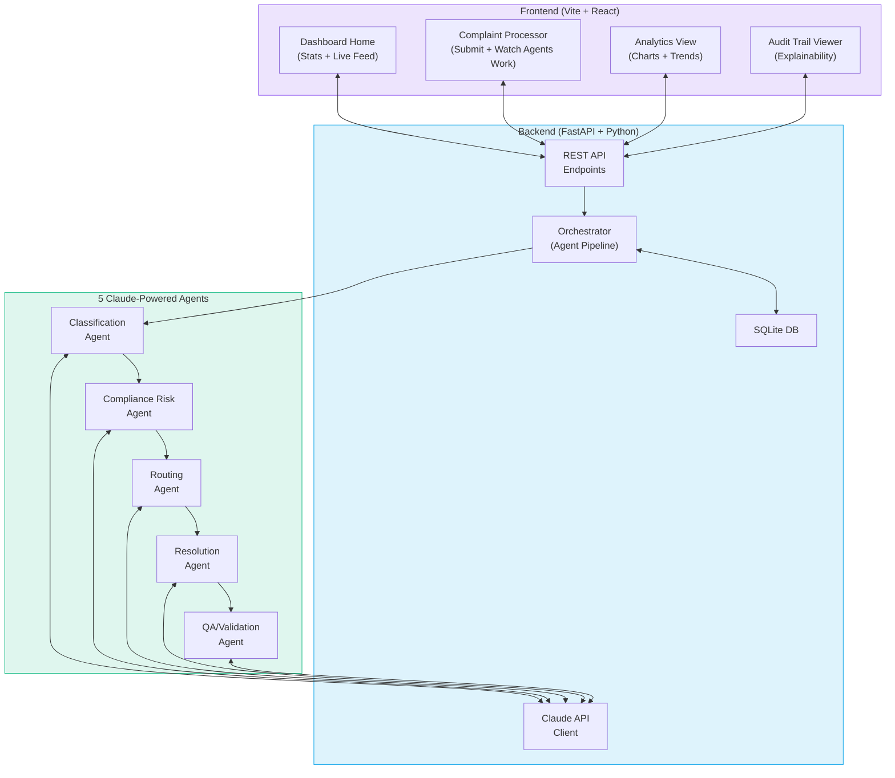

# Agentic AI Complaint Categorization — Full Prototype Implementation Plan

**Timeline**: 1 day | **Stack**: Python (FastAPI) + React (Vite) + Claude API | **Data**: Curated CFPB subset

## Proposed Changes

### Architecture Overview



> [!IMPORTANT]
> **Prototype Simplifications** (vs. full brainstorm):
> - Skip fine-tuned DeBERTa classifiers — use Claude for all NLP tasks (saves hours of ML training)
> - Skip Root Cause Analysis Agent and Fairness Auditor Agent — focus on the 5 core agents
> - Use SQLite instead of PostgreSQL + Vector DB — sufficient for demo
> - Use SSE (Server-Sent Events) for real-time agent progress instead of WebSockets
> - Embed ~50 curated CFPB complaints as sample data (no need to download full 700MB CSV)

---

### Component 1: Project Setup

#### [NEW] Project root config files

- `backend/requirements.txt` — FastAPI, anthropic SDK, uvicorn, sqlite
- `frontend/` — Vite + React app (via `create-vite`)
- `.env` — `ANTHROPIC_API_KEY` placeholder

---

### Component 2: Backend — Data Layer

#### [NEW] [sample_complaints.py](file:///Users/manan/Documents/fintech/backend/data/sample_complaints.py)
50 curated, realistic CFPB-style complaint narratives covering:
- Credit Cards (disputes, fees, fraud)
- Loans (origination issues, servicing)
- Digital Banking (account access, transfers)
- Debt Collection (harassment, incorrect amounts)

Each with: narrative, product, sub-product, state, date, tags, channel.

#### [NEW] [database.py](file:///Users/manan/Documents/fintech/backend/database.py)
SQLite setup with tables:
- `complaints` — raw complaint data + status
- `analysis_results` — agent outputs per complaint
- `audit_logs` — full decision chain for explainability
- `metrics` — system performance tracking

#### [NEW] [schemas.py](file:///Users/manan/Documents/fintech/backend/models/schemas.py)
Pydantic models for:
- `ComplaintInput` — incoming complaint
- `ClassificationResult` — product, issue, severity, sentiment, confidence
- `ComplianceRiskResult` — risk score, flags, regulation citations
- `RoutingResult` — assigned team, priority, SLA deadline
- `ResolutionResult` — action plan, customer response, prevention recommendations
- `QAResult` — validation checks, pass/fail
- `FullAnalysis` — aggregated output from all agents
- `AuditTrailEntry` — explainability chain

---

### Component 3: Backend — Agent Pipeline

Each agent = a specialized Claude API call with a carefully engineered system prompt + structured JSON output.

#### [NEW] [base_agent.py](file:///Users/manan/Documents/fintech/backend/agents/base_agent.py)
Abstract base with:
- Claude API client initialization (anthropic SDK)
- Common `run()` method that calls Claude, parses response, logs to audit trail
- Retry logic and error handling
- Timing/metrics collection

#### [NEW] [classification_agent.py](file:///Users/manan/Documents/fintech/backend/agents/classification_agent.py)
- **System prompt**: Financial complaint classification expert
- **Input**: Raw narrative + metadata
- **Output**: Product, sub-product, issue, sub-issue, severity (1-5), sentiment (-1 to 1), urgency, confidence, reasoning chain
- Uses Claude's tool-use with a strict JSON schema to guarantee output structure

#### [NEW] [compliance_agent.py](file:///Users/manan/Documents/fintech/backend/agents/compliance_agent.py)
- **System prompt**: Financial regulatory compliance expert (UDAAP, ECOA, TILA, FCRA, EFTA, SCRA)
- **Input**: Narrative + classification result
- **Output**: Risk score (0-100), applicable regulations, violation flags, evidence spans from narrative, explainable reasoning
- Key: Must cite specific narrative excerpts and map to specific regulation sections

#### [NEW] [routing_agent.py](file:///Users/manan/Documents/fintech/backend/agents/routing_agent.py)
- **System prompt**: Complaint routing specialist
- **Input**: Classification + compliance results
- **Output**: Assigned team, agent tier (junior/senior/manager), priority level, SLA deadline, escalation flags, reasoning
- Rule-aware: high compliance risk → immediate legal/compliance escalation

#### [NEW] [resolution_agent.py](file:///Users/manan/Documents/fintech/backend/agents/resolution_agent.py)
- **System prompt**: Resolution planning expert with regulatory compliance training
- **Input**: All prior agent outputs
- **Output**: 3 artifacts:
  1. Internal action plan (numbered steps with timelines)
  2. Customer response letter (regulatory-compliant, empathetic)
  3. Preventive recommendations

#### [NEW] [qa_agent.py](file:///Users/manan/Documents/fintech/backend/agents/qa_agent.py)
- **System prompt**: Quality assurance auditor — adversarial reviewer
- **Input**: All outputs from all prior agents + original narrative
- **Output**: Validation checklist (8-10 checks), pass/fail per check, overall quality score, improvement suggestions

#### [NEW] [orchestrator.py](file:///Users/manan/Documents/fintech/backend/agents/orchestrator.py)
Sequential pipeline coordinator:
1. Receives complaint
2. Runs each agent in sequence, passing prior outputs forward
3. Aggregates results into `FullAnalysis`
4. Stores in SQLite with audit trail
5. Supports SSE streaming of agent progress (agent started → agent completed → next agent)

---

### Component 4: Backend — API Layer

#### [NEW] [main.py](file:///Users/manan/Documents/fintech/backend/main.py)
FastAPI application with endpoints:

| Method | Endpoint | Purpose |
|---|---|---|
| `POST` | `/api/complaints/analyze` | Submit complaint for full pipeline analysis |
| `GET` | `/api/complaints/analyze/{id}/stream` | SSE stream of agent progress |
| `GET` | `/api/complaints` | List all processed complaints |
| `GET` | `/api/complaints/{id}` | Get full analysis for a complaint |
| `GET` | `/api/complaints/samples` | Get sample CFPB complaints |
| `GET` | `/api/dashboard/stats` | Aggregate dashboard statistics |
| `GET` | `/api/dashboard/trends` | Complaint trends data |
| `GET` | `/api/audit/{complaint_id}` | Full audit trail for a complaint |
| `POST` | `/api/complaints/batch` | Batch-process multiple sample complaints |

CORS configured for frontend dev server.

---

### Component 5: Frontend — Design System & Layout

Dark theme, glassmorphism, premium aesthetic following the design system from the auto dealership project.

#### [NEW] [index.css](file:///Users/manan/Documents/fintech/frontend/src/index.css)
Design tokens:
- Color palette: Deep navy/charcoal background, electric blue + emerald + amber accents
- Glassmorphism cards with `backdrop-filter: blur()`
- Smooth animations and transitions
- Risk-level color coding: 🔴 Critical → 🟠 High → 🟡 Medium → 🟢 Low
- Typography: Inter font family

#### [NEW] [App.jsx](file:///Users/manan/Documents/fintech/frontend/src/App.jsx)
Main layout with sidebar navigation:
- **Dashboard** (home) — overview stats + recent complaints
- **Process Complaint** — submit new or pick sample + watch agents work
- **Analytics** — charts and trends
- **Audit Trail** — compliance explainability viewer

---

### Component 6: Frontend — Dashboard Page

#### [NEW] [Dashboard.jsx](file:///Users/manan/Documents/fintech/frontend/src/pages/Dashboard.jsx)
- **Hero stats row**: Total complaints processed, avg resolution time, compliance risk catches, auto-resolution rate — animated counters
- **Live complaint feed**: Recent complaints with status badges, risk indicators, assigned teams
- **Risk distribution**: Donut/pie chart showing complaints by risk level
- **Product breakdown**: Bar chart showing complaints by product category
- **SLA compliance gauge**: Circular progress showing timely response rate

---

### Component 7: Frontend — Complaint Processor Page (The Star Feature)

#### [NEW] [ProcessComplaint.jsx](file:///Users/manan/Documents/fintech/frontend/src/pages/ProcessComplaint.jsx)
The key interactive demo page:

1. **Input panel** (left): Text area for custom complaint narrative OR dropdown of sample CFPB complaints
2. **Agent Pipeline Visualization** (center): Vertical pipeline showing 5 agents as connected nodes
   - Each node lights up when active (pulsing animation)
   - Shows agent output when complete (expandable cards)
   - Sequential flow animation
3. **Results panel** (right): Final resolution output
   - Classification badge (product + issue)
   - Risk score gauge (0-100 with color gradient)
   - Routing assignment card
   - Resolution plan (tabbed: Action Plan | Customer Response | Prevention)
   - QA score with checklist

SSE integration to show agents working in real-time.

---

### Component 8: Frontend — Analytics Page

#### [NEW] [Analytics.jsx](file:///Users/manan/Documents/fintech/frontend/src/pages/Analytics.jsx)
Charts and visualizations (using lightweight Chart.js or Recharts):
- Complaints over time (line chart)
- Product distribution (horizontal bar)
- Severity distribution (stacked bar)
- Compliance risk heatmap
- Average resolution time by product
- Top issues word cloud or treemap

---

### Component 9: Frontend — Audit Trail Page

#### [NEW] [AuditTrail.jsx](file:///Users/manan/Documents/fintech/frontend/src/pages/AuditTrail.jsx)
Regulatory explainability viewer:
- Select a complaint → see full decision chain
- Each agent's reasoning displayed with evidence highlights
- Clickable regulation citations
- Exportable as JSON for regulatory submissions
- Timeline view of agent decisions

---

## Technical Decisions

| Decision | Choice | Rationale |
|---|---|---|
| **Claude model** | `claude-sonnet-4-20250514` | Best speed/quality balance for prototype; fast enough for demo |
| **Structured output** | Tool-use with strict JSON schemas | Guarantees parseable agent outputs |
| **Agent orchestration** | Simple sequential Python pipeline | No heavy framework needed for 5 agents; keeps prototype lean |
| **Real-time updates** | Server-Sent Events (SSE) | Simpler than WebSockets; sufficient for unidirectional agent progress |
| **Database** | SQLite (single file) | Zero setup; portable; fine for demo scale |
| **Charts** | Recharts (React) | Lightweight, composable, great animations |
| **Styling** | Vanilla CSS with CSS custom properties | Full control; no build-step dependencies |

---

## File Structure

```
/Users/manan/Documents/fintech/
├── backend/
│   ├── main.py                          # FastAPI app + all endpoints
│   ├── database.py                      # SQLite setup + queries
│   ├── requirements.txt                 # Python dependencies
│   ├── agents/
│   │   ├── __init__.py
│   │   ├── base_agent.py                # Abstract base agent class
│   │   ├── classification_agent.py      # Product/issue classification
│   │   ├── compliance_agent.py          # Regulatory risk scoring
│   │   ├── routing_agent.py             # Team assignment
│   │   ├── resolution_agent.py          # Resolution plan generation
│   │   ├── qa_agent.py                  # Quality assurance validation
│   │   └── orchestrator.py              # Pipeline coordinator
│   ├── models/
│   │   ├── __init__.py
│   │   └── schemas.py                   # Pydantic models
│   └── data/
│       └── sample_complaints.py         # 50 curated CFPB complaints
├── frontend/
│   ├── index.html
│   ├── package.json
│   ├── vite.config.js
│   └── src/
│       ├── main.jsx
│       ├── App.jsx                      # Layout + routing
│       ├── index.css                    # Design system
│       ├── pages/
│       │   ├── Dashboard.jsx            # Overview stats + feed
│       │   ├── ProcessComplaint.jsx     # Agent pipeline demo
│       │   ├── Analytics.jsx            # Charts + trends
│       │   └── AuditTrail.jsx           # Explainability viewer
│       └── components/
│           ├── Sidebar.jsx              # Navigation sidebar
│           ├── AgentPipeline.jsx         # Agent status visualization
│           ├── RiskGauge.jsx            # Circular risk score
│           ├── StatCard.jsx             # Animated stat counter
│           └── ComplaintCard.jsx        # Complaint list item
└── .env                                 # ANTHROPIC_API_KEY
```

---

## Verification Plan

### Automated Tests
1. Start backend with `uvicorn backend.main:app`
2. Test sample complaints endpoint returns data
3. Submit a complaint and verify all 5 agents produce valid JSON output
4. Check audit trail is complete for processed complaint

### Manual Verification
1. Open frontend dashboard — verify stats display and charts render
2. Submit a sample complaint — watch agent pipeline animate in real-time
3. Verify classification, risk scoring, routing, and resolution all make sense
4. Check audit trail shows complete explainability chain
5. Process 3-5 different complaint types to show versatility

### Demo Script
1. Open Dashboard → show pre-loaded analytics from batch-processed samples
2. Navigate to Process Complaint → pick a credit card fraud complaint → watch all 5 agents work sequentially
3. Show the resolution plan with internal action items + customer response letter
4. Navigate to Audit Trail → show full explainability chain for a regulator
5. Pick a high-risk UDAAP complaint → show compliance agent flagging specific violations with regulation citations
